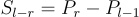

# problem

## description

Given an array of integers A and an integer B.
Find the total number of subarrays having sum equals to B.

## constraints

 1 <= length of the array <= 50000
-1000 <= A[i] <= 1000

## output

Return the total number of subarrays having sum equals to B.

## hints and tricks

you have to start by doing the prefix sum of the array.

then you use the  following formula to help you

